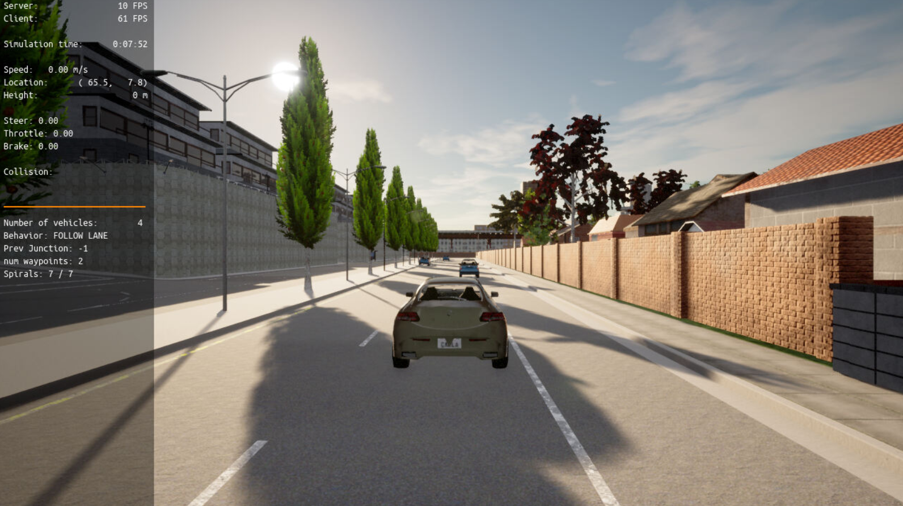
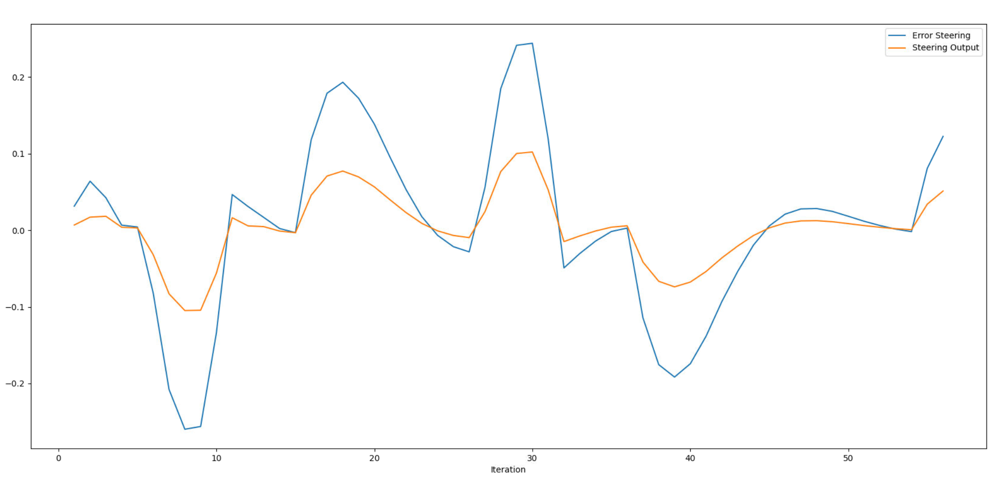
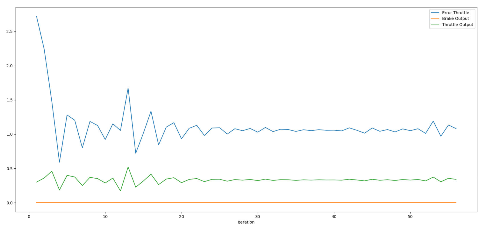

# Control and Trajectory Tracking for Autonomous Vehicle

# Proportional-Integral-Derivative (PID)

In this project, you will apply the skills you have acquired in this course to design a PID controller to perform vehicle trajectory tracking. Given a trajectory as an array of locations, and a simulation environment, you will design and code a PID controller and test its efficiency on the CARLA simulator used in the industry.

### Installation

Run the following commands to install the starter code in the Udacity Workspace:

Clone the <a href="https://github.com/udacity/nd013-c6-control-starter/tree/master" target="_blank">repository</a>:

`git clone https://github.com/udacity/nd013-c6-control-starter.git`

## Run Carla Simulator

Open new window

* `su - student`
// Will say permission denied, ignore and continue
* `cd /opt/carla-simulator/`
* `SDL_VIDEODRIVER=offscreen ./CarlaUE4.sh -opengl`

## Compile and Run the Controller

Open new window

* `cd nd013-c6-control-starter/project`
* `./install-ubuntu.sh`
* `cd pid_controller/`
* `rm -rf rpclib`
* `git clone https://github.com/rpclib/rpclib.git`
* `cmake .`
* `make` (This last command compiles your c++ code, run it after every change in your code)

## Testing

To test your installation run the following commands.

* `cd nd013-c6-control-starter/project`
* `./run_main_pid.sh`
This will silently fail `ctrl + C` to stop
* `./run_main_pid.sh` (again)
Go to desktop mode to see CARLA

If error bind is already in use, or address already being used

* `ps -aux | grep carla`
* `kill id`


## Project Instructions

In the previous project you built a path planner for the autonomous vehicle. Now you will build the steer and throttle controller so that the car follows the trajectory.

You will design and run the a PID controller as described in the previous course.

In the directory [/pid_controller](https://github.com/udacity/nd013-c6-control-starter/tree/mathilde/project_c6/project/pid_controller)  you will find the files [pid.cpp](https://github.com/udacity/nd013-c6-control-starter/tree/mathilde/project_c6/project/pid_controller/pid.cpp)  and [pid.h](https://github.com/udacity/nd013-c6-control-starter/tree/mathilde/project_c6/project/pid_controller/pid.h). This is where you will code your pid controller.
The function pid is called in [main.cpp](https://github.com/udacity/nd013-c6-control-starter/tree/mathilde/project_c6/project/pid_controller/main.cpp).

### Step 1: Build the PID controller object
Complete the TODO in the [pid_controller.h](https://github.com/udacity/nd013-c6-control-starter/tree/mathilde/project_c6/project/pid_controller/pid_controller.h) and [pid_controller.cpp](https://github.com/udacity/nd013-c6-control-starter/tree/mathilde/project_c6/project/pid_controller/pid_controller.cpp).

Run the simulator and see in the desktop mode the car in the CARLA simulator. Take a screenshot and add it to your report. The car should not move in the simulation.
### Step 2: PID controller for throttle:
1) In [main.cpp](https://github.com/udacity/nd013-c6-control-starter/tree/mathilde/project_c6/project/pid_controller/main.cpp), complete the TODO (step 2) to compute the error for the throttle pid. The error is the speed difference between the actual speed and the desired speed.

Useful variables:
- The last point of **v_points** vector contains the velocity computed by the path planner.
- **velocity** contains the actual velocity.
- The output of the controller should be inside [-1, 1].

2) Comment your code to explain why did you computed the error this way.

3) Tune the parameters of the pid until you get satisfying results (a perfect trajectory is not expected).

### Step 3: PID controller for steer:
1) In [main.cpp](https://github.com/udacity/nd013-c6-control-starter/tree/mathilde/project_c6/project/pid_controller/main.cpp), complete the TODO (step 3) to compute the error for the steer pid. The error is the angle difference between the actual steer and the desired steer to reach the planned position.

Useful variables:
- The variable **y_points** and **x_point** gives the desired trajectory planned by the path_planner.
- **yaw** gives the actual rotational angle of the car.
- The output of the controller should be inside [-1.2, 1.2].
- If needed, the position of the car is stored in the variables **x_position**, **y_position** and **z_position**

2) Comment your code to explain why did you computed the error this way.

3) Tune the parameters of the pid until you get satisfying results (a perfect trajectory is not expected).

### Step 4: Evaluate the PID efficiency
The values of the error and the pid command are saved in thottle_data.txt and steer_data.txt.
Plot the saved values using the command (in nd013-c6-control-refresh/project):

```
python3 plot_pid.py
```

You might need to install a few additional python modules: 

```
pip3 install pandas
pip3 install matplotlib
```

Answer the following questions:
- Add the plots to your report and explain them (describe what you see)
- What is the effect of the PID according to the plots, how each part of the PID affects the control command?
- How would you design a way to automatically tune the PID parameters?
- PID controller is a model free controller, i.e. it does not use a model of the car. Could you explain the pros and cons of this type of controller?
- (Optional) What would you do to improve the PID controller?


### Tips:

- When you wil be testing your c++ code, restart the Carla simulator to remove the former car from the simulation.
- If the simulation freezes on the desktop mode but is still running on the terminal, close the desktop and restart it.
- When you will be tuning the PID parameters, try between those values:


## Project Writeup

### Build the PID controller object
The following image shows the CARLA simulator after completing the TODOs in the pid_controller.h and pid_controller.cpp.



### Steering plot
In this plot you can see the steering output in orange and the error of the steering in blue. The PID controller tries to reduce the error. Nevertheless the rate of change is slightly to high. In that case some more tuning especially in the derivate term could be helpful.



### Throttle plot
The following plot shows the throttle (green) and brake output (orange) as well as the error of the throttle (blue). In the first 20 iteration the error of the PID controller swings a lot. After some further iteration the integral term can compensate that error. The low proportonial term causes an offset of the cross track error. Anyways the car drove much smoother through the track.  



### What is the effect of the PID according to the plots, how each part of the PID affects the control command?

#### Proportional term
This term produces an output value that is proportional to the current cross track error. A high value results in a large change in the output for a given change in the error. In that case the car overshoots a lot. That brings a wave like pattern in the plots.


#### Integral term
The integral term brings a persisting error to zero. This force will increased as time passes. By applying a too high value when the error is small and decreasing, the car would also overshoot.


#### Derivate term
This term influences the rate of change of error by trying to flattenig the error into a horizontal line. This prevents an overshoot.  


The car didn't finish the track completely and the trajectory is not perfect either. So there is a lot of potential to improve the PID controller.


### How would you design a way to automatically tune the PID parameters?
To automatically tune the PID parameters I would use the TWIDDLE algorithm which was introduced in the lesson before. Another way is to use machine learning to tune the parameters.


### PID controller is a model free controller, i.e. it does not use a model of the car. Could you explain the pros and cons of this type of controller?
An advantage of a model free controller is that it is not as complex as a model based controller. Therefore, you can use it to solve any problem without changing the settings. Additionally, you can calculate the output very fast which makes it usable for realtime applications.   
A disvantage is that the model free controller does not take care of the boundary conditions of a specific car. Also, the PID controller can only calculate the best output for the current situation. That makes it hard to deal with several scenarios because of the delay of the controller.


### (Optional) What would you do to improve the PID controller?
I would try to integrate the TWIDDLE algorithm into the code.


